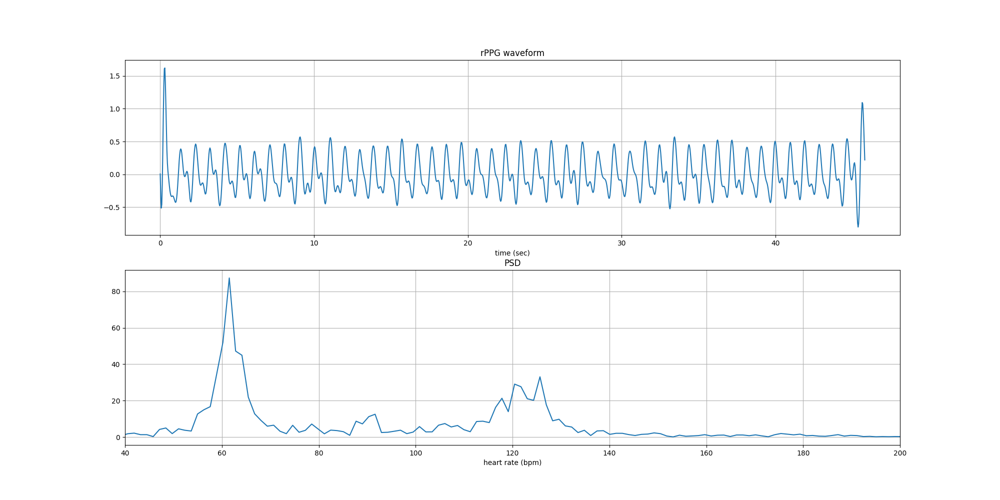

# Demo

Pretrained weights on [UBFC-rPPG](https://sites.google.com/view/ybenezeth/ubfcrppg) dataset and demo code are in the `demo` folder. The packages in `../requirement.txt` should be installed. A additional [facenet_pytorch](https://github.com/timesler/facenet-pytorch) library for face detection should be installed.

You can download my face video [here](https://1drv.ms/v/s!AtCpzthip8c9-xrjywnTLZH8c3aF?e=mVkhCE) and save the test video in the `demo` folder. The test face video was recorded by a Logitech C920 webcam and [OBS studio](https://obsproject.com/) with the lossless recording setup.

In the `demo` folder, simply run
```
python demo.py
```


The measured rPPG signals will be shown in `results.png` as below, and the heart rate will be printed.



You can also use your face video to test the demo. You just need to change line 10 in `demo.py` with your own video path. To improve the running speed, in the face recognition step, we only detect the face in the first frame and keep the bounding box fixed in the following frames. Therefore, please keep stationary in your face video.
